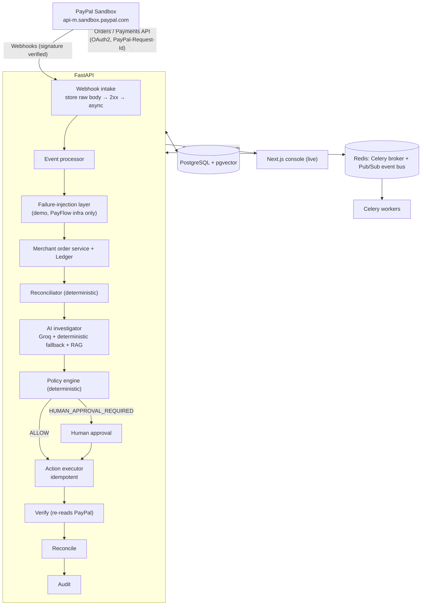

# PayFlow AI — Real-Time Autonomous Payment Operations

> **PayFlow AI is an autonomous payment-operations teammate that observes real payment-provider events,
> investigates inconsistencies, applies deterministic policies, executes authorized recovery actions, verifies
> outcomes, reconciles financial state, and maintains a complete audit trail.**

PayFlow runs against **PayPal Sandbox**: real Orders API calls, real sandbox buyer approval, real captures, real
refunds and signature-verified webhooks. No real money moves and live PayPal endpoints are never used.

To show recovery, PayFlow can deliberately break **its own** downstream infrastructure (merchant order service,
ledger, webhook intake, reconciliation scheduler, verifier). That is **demo failure injection**, and it is always
labelled. PayPal's result is never altered:

```
PAYPAL RESULT            PAYFLOW DETECTED              PAYFLOW RESPONSE
COMPLETED ✓              LEDGER_WRITE_FAILURE ✕        AUTOMATIC RECONCILIATION ✓
(PayPal Sandbox)         (PayFlow demo environment)
```

*"PayPal successfully processed the sandbox payment, but PayFlow intentionally introduced a downstream ledger
failure to demonstrate autonomous recovery."*

---

## What makes PayFlow different

| Capability | Why it matters |
|---|---|
| **LangGraph incident agent** | The lifecycle is an explicit `StateGraph` (investigate → decide → execute/human gate → verify → reconcile). Every node is a deterministic PayFlow stage, so no LLM inside the graph can move money. The path each incident took is recorded and drawn in the console. |
| **Policy can overrule the AI** | Guardrail **PB-001** checks the AI's action against the remediation playbook. In production the model once recommended `RETRY_WEBHOOK` for a ledger mismatch; the policy now rejects it and substitutes `RECONCILE_LEDGER`, and the override is audited. |
| **Explainable risk score (0–100)** | Every decision carries a score with named factors (amount vs limit, AI uncertainty, incident type, repeat customer, outbound money). A score of 75 or more requires a human. |
| **Four-eyes on internal faults** | Rule **SYS-FAULT**: when PayFlow's own ledger, merchant service or webhook intake caused the incident, the fix waits for a human (the system that would apply the correction is the one that failed). Rule **LEDGER-AMT**: correcting a booked amount is a manual journal adjustment and always follows maker-checker. If the systems reconcile on their own first (e.g. a delayed webhook arrives), the incident self-heals and the pending approval is withdrawn. |
| **Kill switch + circuit breaker** | One switch pauses all autonomous financial actions. A rolling-window breaker caps automated fixes so runaway automation is contained. |
| **Human resolution** | Escalated incidents can be acknowledged, retried with human authorisation (new idempotency attempt key), resolved after a fresh reconciliation (or with explicit risk acceptance), or closed as a false positive. |
| **Rich AI analysis** | Root cause, confidence rationale, customer impact, financial exposure, blast radius, urgency, an ordered remediation plan, contributing factors, prevention and anomalies, from Groq (`reasoning_effort=low`, hidden reasoning) or the deterministic fallback. |
| **Fintech-grade alerting** | P1–P4 severity routing to WhatsApp (Meta Cloud API), Telegram, phone push (ntfy), Slack or webhook, plus an in-app alert centre. Alerts are deduplicated and delivered from a transactional outbox with per-channel receipts. Unacknowledged P1/P2 alerts re-escalate, and alerts auto-resolve with the incident. Desktop notifications for P1/P2. |
| **Tamper-evident audit** | A background sealer hash-chains audit records with SHA-256. `GET /api/audit/verify` proves integrity and pinpoints the first altered record. |
| **Reconciliation analytics** | Money at risk per break, break ageing, SLA breaches by severity, auto-match rate, auto-heal rate, median time to resolve, and a per-payment match fingerprint. |
| **Provider-replay guard** | PayPal order idempotency keys are globally unique, and any PayPal response whose amount differs from the request is refused. Both close a real production bug where a $10 order came back for a $50 request. |

## Architecture



### Safety model (mandatory chain)

```
PAYPAL → WEBHOOK/API → EVENT PROCESSOR → RECONCILIATOR → AI INVESTIGATOR → POLICY ENGINE
        → {ALLOW | HUMAN APPROVAL} → ACTION EXECUTOR → VERIFY → RECONCILE → AUDIT
```

The LLM never executes payments or refunds, never modifies the ledger, never bypasses policy or human approval,
and never generates SQL. It returns a Pydantic-validated recommendation; everything else is deterministic code.

## What is real vs. demo

| Thing | Real PayPal Sandbox | PayFlow demo |
|---|---|---|
| Order creation, buyer approval, capture | ✓ Orders v2 | |
| Refund (Demo C) | ✓ Payments v2 `captures/{id}/refund` | |
| Webhooks | ✓ verified via `verify-webhook-signature` | |
| Negative testing (`INSTRUMENT_DECLINED`, …) | ✓ PayPal returns the error (`PayPal-Mock-Response`) | |
| Ledger / merchant / webhook-intake failures | | ✓ `DEMO FAILURE INJECTION` |
| Historical incidents, 100+ historical payments | | ✓ labelled **Historical PayFlow** |

Incidents carry `failure_source`: `PAYPAL_PROVIDER_FAILURE` (PayPal said no) vs `PAYFLOW_INFRASTRUCTURE_FAILURE`
(PayFlow broke, deliberately or not) vs `HISTORICAL`. The UI shows both side by side.

## Tech stack

| Layer | Tech |
|---|---|
| Frontend | Next.js 16 (App Router), TypeScript, Tailwind v4, shadcn/ui-style components, Lucide, Recharts, SSE (`EventSource`) |
| Backend | Python 3.12, FastAPI, Pydantic v2, SQLAlchemy 2.0 async, Alembic, httpx |
| Provider | PayPal Sandbox REST (OAuth2 client credentials, Orders v2, Payments v2, webhook verification) |
| Data | PostgreSQL 16 + pgvector, JSONB |
| Queue / events | Redis + Celery (retries with backoff, dead-letter to audit), Redis Pub/Sub → SSE |
| AI | Groq (JSON mode, Pydantic-validated) with deterministic fallback; RAG over historical incidents |

## Key backend modules

```
Backend/app/
├── payments/            base.py (PaymentProvider protocol), paypal.py, paypal_auth.py (token cache), sandbox.py (live-endpoint guard, negative testing)
├── failure_injection/   scenarios.py, service.py (arm / fire / attribute; never touches PayPal)
├── events/              bus.py (publish-after-commit, Redis Pub/Sub + in-process fallback), stream.py (SSE)
├── services/            paypal_service.py (order → capture → downstream → webhooks), orchestrator.py,
│                        reconciliation_service.py, policy_service.py, action_executor.py, verification_service.py, …
├── workers/             jobs.py (post_capture, reconcile, process_webhook, …), dispatcher.py, tasks.py (Celery)
└── api/routes/          paypal.py, webhooks.py, failures.py, demo.py, incidents.py, actions.py, …
```

### Data model

`payments` keeps **separate** states: `provider_status` (raw PayPal, e.g. `COMPLETED`), normalized `gateway_status`,
`bank_status` (settlement), `merchant_status`, `ledger_status`, `webhook_status`, `reconciliation_status`, plus the
canonical `overall_status` (state machine). New tables: `provider_transactions` (every PayPal call, idempotency key,
PayPal-Debug-Id), `webhook_events` (unique `provider_event_id`, raw body, signature result, processing status,
delivery count), `failure_injections`, `reconciliation_runs`, `approvals`. Payer data is limited to payer id,
email, name and country; no instrument data is stored.

### Idempotency

| Operation | Key |
|---|---|
| PayPal order | `PayPal-Request-Id: paypal:order:TXN92831` |
| PayPal capture | `PayPal-Request-Id: paypal:capture:<ORDER_ID>` |
| PayPal refund | `PayPal-Request-Id: paypal:refund:<CAPTURE_ID>` |
| PayFlow actions | `payflow:reconcile:TXN92831` (unique DB constraint + atomic APPROVED→EXECUTING claim) |
| Webhooks | unique `webhook_events.provider_event_id`; redeliveries increment `delivery_count` and do nothing |

---

## Setup

### Step 1 — PayPal Developer / Sandbox app

1. Sign in at <https://developer.paypal.com> → **Apps & Credentials** → **Sandbox** → *Create App* (Merchant).
2. Copy the **Client ID** and **Secret** → `PAYPAL_CLIENT_ID`, `PAYPAL_CLIENT_SECRET`.
3. **Testing tools → Sandbox accounts**: you get a sandbox *Business* account (receives funds) and a sandbox
   *Personal* buyer account. Note the buyer email and password (View/Edit account); you log in as this buyer
   during the demo.

### Step 2 — Webhook (optional but recommended)

PayPal must reach FastAPI over public HTTPS. Use any tunnel; PayFlow does not depend on a specific provider:

```bash
ngrok http 8000
# or
cloudflared tunnel --url http://localhost:8000
```

In your sandbox app → **Webhooks** → *Add webhook*:

- URL: `https://YOUR_PUBLIC_DOMAIN/api/webhooks/paypal`
- Events (only what PayFlow uses): `CHECKOUT.ORDER.APPROVED`, `PAYMENT.CAPTURE.COMPLETED`,
  `PAYMENT.CAPTURE.DENIED`, `PAYMENT.CAPTURE.PENDING`, `PAYMENT.CAPTURE.REFUNDED`,
  `CHECKOUT.PAYMENT-APPROVAL.REVERSED`

Copy the **Webhook ID** → `PAYPAL_WEBHOOK_ID`, and the URL → `PAYPAL_WEBHOOK_URL`.

Without a webhook, everything still works: PayPal's API responses are authoritative, `webhook_status` shows
`NOT_CONFIGURED`, and the webhook-specific failure scenarios are disabled.

### Step 3 — `.env`

```bash
cp Backend/.env.example Backend/.env        # PowerShell: Copy-Item Backend\.env.example Backend\.env
cp frontend/.env.example frontend/.env.local
```

| Variable | Notes |
|---|---|
| `PAYMENT_PROVIDER=paypal`, `PAYPAL_ENVIRONMENT=sandbox` | Sandbox is the only accepted value |
| `PAYPAL_CLIENT_ID`, `PAYPAL_CLIENT_SECRET` | Server-side only; never sent to the frontend or logged |
| `PAYPAL_WEBHOOK_ID`, `PAYPAL_WEBHOOK_URL` | From Step 2 |
| `FRONTEND_URL` | PayPal return/cancel URLs (`http://localhost:3000`) |
| `DATABASE_URL`, `REDIS_URL` | Defaults `localhost:5433` / `localhost:6380` (see Step 4) |
| `GROQ_API_KEY`, `GROQ_MODEL` | Optional; without a key the deterministic investigator runs |
| `PIPELINE_MODE` | `auto` (Celery if a worker is up, else in-process), `celery`, `inline`, `sync` (tests) |
| `PIPELINE_STEP_DELAY_SECONDS` | Visual pacing of pipeline stages (0.8) |
| `ENABLE_FAILURE_INJECTION` | `true` to expose the demo failure-injection panel |
| `ENABLE_PAYPAL_NEGATIVE_TESTING` | `true` to send PayPal negative-testing codes at capture |
| `REFUND_AUTO_APPROVE_LIMIT_USD` | Refunds above this need human approval (default $25) |
| `WEBHOOK_GRACE_SECONDS`, `WEBHOOK_DELAY_SECONDS`, `RECONCILIATION_DELAY_SECONDS` | Timers for webhook-loss detection and injections |

`.env` files are git-ignored. `frontend/.env.local`: `NEXT_PUBLIC_API_URL=http://localhost:8000`.

### Step 4 — Infrastructure

```bash
docker compose up -d
```

Starts `payflow-postgres` (pgvector) and `payflow-redis`. Host ports default to 5432/6379; the root `.env` on this
machine overrides them to **5433/6380** (`POSTGRES_PORT`, `REDIS_PORT`). Keep `DATABASE_URL`/`REDIS_URL` in sync.
PayPal is never emulated locally.

### Step 5 — Backend

```bash
cd Backend
python -m venv .venv
source .venv/bin/activate            # Windows: .venv\Scripts\activate
pip install -r requirements.txt
alembic upgrade head
python -m app.seed
uvicorn app.main:app --reload --port 8000
```

Celery (optional; without it pipelines run in-process):

```bash
celery -A app.workers.celery_app worker --loglevel=info            # Windows: add --pool=solo
```

### Step 6 — Frontend

```bash
cd frontend
npm install
npm run dev
```

Open <http://localhost:3000>.

### Step 7 — Tunnel

Keep the tunnel from Step 2 running (`ngrok http 8000`), and make sure the webhook URL in PayPal matches it. The
dashboard's **System status → Webhook** turns `VERIFIED` after the first verified event.

### Operator alerts (WhatsApp, Telegram, phone push)

All channels are optional; configure any of them in `Backend/.env` (or the Render dashboard):

| Channel | Setup |
|---|---|
| **Phone push (fastest)** | Install the free **ntfy** app, subscribe to a hard-to-guess topic, set `NTFY_TOPIC=<topic>`. |
| **WhatsApp (Meta Cloud API)** | developers.facebook.com → your app → WhatsApp → API Setup: add the admin number as a recipient. Set `WHATSAPP_ACCESS_TOKEN` (use a permanent System User token in production; the API Setup token expires in 24h), `WHATSAPP_PHONE_NUMBER_ID`, `ALERT_WHATSAPP_TO=91XXXXXXXXXX`. Send any message to the business number from the admin phone once a day to keep the 24h window open for full-text alerts; outside it PayFlow falls back to the `hello_world` template as a wake-up ping. |
| **Telegram** | Create a bot with @BotFather, message it once, read your chat id from `https://api.telegram.org/bot<token>/getUpdates`. Set `TELEGRAM_BOT_TOKEN`, `TELEGRAM_CHAT_ID`. |
| **Slack / Teams / PagerDuty bridge** | `SLACK_WEBHOOK_URL` or `ALERT_WEBHOOK_URL`. |

Then open **Alerts → Send test alert**. Routing: P1/P2 → all channels, P3 → WhatsApp/push/Slack/webhook, P4 → in-app only.
Unacknowledged P1/P2 alerts are re-sent every `ALERT_ESCALATION_MINUTES` (max 3).

### Local vs hosted (automatic)

| Where it runs | API the console uses | Settings the API reads |
|---|---|---|
| `localhost:3000` | `http://localhost:8000` | `Backend/.env` overridden by `Backend/.env.local` (git-ignored) |
| Vercel | `NEXT_PUBLIC_API_URL_PRODUCTION` (default `https://payflowai.onrender.com`) | Render dashboard env vars (`RENDER` is detected; `.env.local` is ignored) |

PayPal return URLs follow the console that started the payment (localhost or any trusted `*.vercel.app` origin). Keep
Render's internal hostnames (`dpg-…`, `red-…`) in Render only; locally `.env.local` points at Docker
(`localhost:5433` / `localhost:6380`).

### PayPal negative testing (provider failures)

Set `ENABLE_PAYPAL_NEGATIVE_TESTING=true`. The live-demo dialog then offers `INSTRUMENT_DECLINED`,
`TRANSACTION_REFUSED`, `INSUFFICIENT_FUNDS` and `INTERNAL_SERVER_ERROR`. PayFlow sends
`PayPal-Mock-Response: {"mock_application_codes": "<CODE>"}` on the capture call and **PayPal** returns the error.
The incident is labelled `PAYPAL_PROVIDER_FAILURE` (`PROVIDER_DECLINED`, or `UNKNOWN_STATE` for 5xx/timeouts where
the outcome is unknown). Check PayPal's negative-testing documentation for which codes apply to which endpoint.

### Tests

```bash
cd Backend
pytest -q
```

147 tests against a real PostgreSQL test database (`payflow_test`), with PayPal mocked at the HTTP layer
(`tests/paypal_mock.py`). There are no live credentials in tests. Coverage includes OAuth caching and 401
refresh, the sandbox-only guard, order, capture and refund idempotency headers, webhook signature verification
(raw body passed verbatim), duplicate and malformed webhooks, every failure-injection scenario, provider failures,
the policy engine, action idempotency, human approval, verification (including PayPal re-checks) and event
publishing. Front end: `npm run typecheck`, `npm run lint`, `npm run build`.

---

## Demo script

### Demo A — Real Sandbox Payment

1. Open the PayFlow dashboard.
2. Show **System status**: PayPal Sandbox `CONNECTED`, PostgreSQL, Redis, Groq, Webhook, Event stream.
3. Click **START LIVE DEMO** → *Live sandbox payment* → **Create Live Sandbox Payment** (START LIVE DEMO).
4. A PayPal Sandbox order is created (`PAYPAL ORDER CREATED` appears live).
5. Click **OPEN PAYPAL SANDBOX CHECKOUT**.
6. Log in and approve with the **sandbox buyer** account.
7. PayPal returns to `/checkout/return`, which captures the order.
8. PayPal returns a successful capture (`PayPal capture COMPLETED`).
9. The PayPal webhook arrives and is verified (if configured).
10. The dashboard updates without a refresh through the SSE live pipeline.

### Demo B — Inject Ledger Failure

1. Select the payment in **DEMO FAILURE INJECTION** (dashboard, or the payment page).
2. Select `LEDGER_WRITE_FAILURE`.
3. Click **Inject Failure**.
4. PayFlow detects the inconsistent state: PayPal `COMPLETED`, merchant `SUCCESS`, ledger `FAILED`.
5. The incident appears in real time (`LEDGER_MISMATCH`, source `PAYFLOW_INFRASTRUCTURE_FAILURE`).
6. The AI investigation starts.
7. The AI identifies a ledger synchronization failure.
8. The policy engine allows reconciliation (**AUTOMATICALLY APPROVED**).
9. `RECONCILE_LEDGER` executes (`payflow:reconcile:TXN…`).
10. Verification succeeds, including a re-read of the capture from the PayPal Sandbox API.
11. The incident becomes **RESOLVED**.
12. The audit trail shows every event.

*One-click variant:* **START LIVE DEMO → Real-time ledger mismatch** arms `LEDGER_WRITE_FAILURE` before checkout
(transaction `TXN92831`). After the buyer approves, the whole chain runs automatically.

### Demo C — Human Approval

1. Select a successful payment (or use **START LIVE DEMO → Refund requires approval**, `TXN92842`, $50).
2. Request a refund (**Request refund** on the payment page; the one-click demo does it automatically).
3. The AI recommends `REFUND`.
4. The policy engine requires human approval ($50 > $25 limit).
5. The approval card appears (**Approvals**).
6. Click **APPROVE**.
7. The PayPal Sandbox refund is executed (`POST /v2/payments/captures/{id}/refund`, `PayPal-Request-Id: paypal:refund:{capture}`).
8. The result is verified (refund re-read from PayPal: `COMPLETED`).
9. The incident closes. Approving again returns the previous result, so there is no second refund.

---

## API

| Method | Path | |
|---|---|---|
| GET | `/api/health` | PayPal (OAuth round-trip), DB, Redis, event bus, Groq, webhook status. No secrets |
| GET | `/api/dashboard/stats` | Metrics + chart series |
| GET | `/api/payments`, `/api/payments/{txn}` | `?provider=PAYPAL_SANDBOX`; detail includes PayPal calls, webhooks, injections |
| POST | `/api/payments/paypal/create-order` | `{amount, demo, failure_scenarios, negative_test}` → approve URL |
| POST | `/api/payments/paypal/capture` | `{order_id}` or `{transaction_id}`; idempotent |
| GET | `/api/payments/{txn}/status` | Compact multi-system status |
| POST | `/api/payments/{txn}/refund-request` | Merchant refund request → incident → policy |
| POST | `/api/webhooks/paypal` | Stores raw body, returns 2xx, verifies + processes async, dedupes |
| GET | `/api/events/stream` | Server-Sent Events (backlog + live) |
| GET / POST | `/api/failures/scenarios`, `/api/failures/inject` | Demo failure injection |
| POST | `/api/demo/live`, `/api/demo/real-time-ledger-mismatch` | One-click live demos |
| POST | `/api/demo/reset` | Reseed historical data |
| POST | `/api/incidents/{id}/acknowledge` · `/retry` · `/resolve` · `/close` | Human resolution of escalated incidents |
| GET / POST | `/api/notifications`, `/{id}/ack`, `/ack-all`, `/channels`, `/test` | Alert centre, receipts, channel setup check |
| GET / POST | `/api/policies`, `/api/policies/kill-switch`, `/api/policies/simulate` | Policy-as-code, kill switch, what-if simulator |
| GET | `/api/agent/graph` | LangGraph topology (+ mermaid) |
| GET | `/api/audit/verify` | SHA-256 audit-chain integrity proof |
| GET | `/api/reconciliation/summary` | Exposure, ageing, SLA, auto-heal, MTTR |
| GET / POST | `/api/incidents…`, `/api/actions/{id}/approve|reject`, `/api/audit`, `/api/reconciliation…` | As before |

## Resilience

| Failure | Behaviour |
|---|---|
| Missing / invalid Groq key, timeout, malformed JSON | Deterministic investigator; reason recorded |
| Redis down | In-process jobs and in-process event bus; SSE keeps working for the API's clients |
| PostgreSQL down | `/api/health` reports it; API returns errors without crashing |
| PayPal timeout / 5xx | Retries with backoff (idempotent); then HTTP 502 with PayPal-Debug-Id; capture outcome recorded as `UNKNOWN` |
| Webhook duplicate / delayed / malformed / bad signature / unknown type | Deduped / held then processed / 400 / `REJECTED` / `IGNORED` |
| Webhook never arrives | Grace-period check raises `WEBHOOK_LOST`; `RETRY_WEBHOOK` re-syncs from the PayPal Orders API |
| Celery job exhausts retries | `JOB_FAILED` audit + incident escalated |

## Known limitations

- The sandbox buyer must approve in PayPal's checkout. PayFlow never fakes approval.
- Webhook-driven scenarios (`WEBHOOK_DELAY`, `WEBHOOK_DROP`, `DUPLICATE_WEBHOOK`) need a public tunnel and
  `PAYPAL_WEBHOOK_ID`.
- Settlement for PayPal payments means funds captured to the sandbox seller balance, not a bank payout.
- Embeddings are local deterministic vectors, not a neural embedding model.
- No authentication or RBAC on the console; the approver name is free text.

## Future improvements

- AuthN/RBAC with maker-checker approvals; PayPal disputes & payouts
- Scheduled settlement-report reconciliation (PayPal Transaction Search API)
- Neural embeddings and a feedback loop from resolved incidents into RAG
